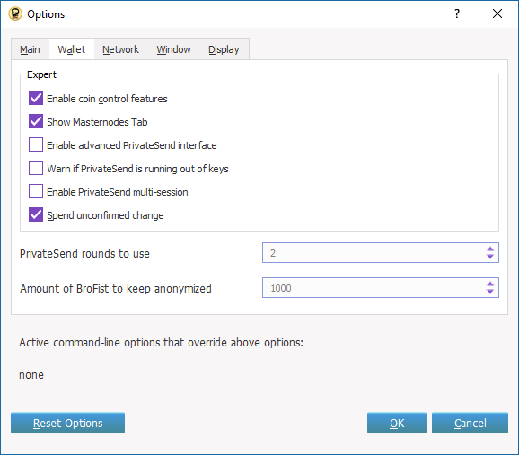
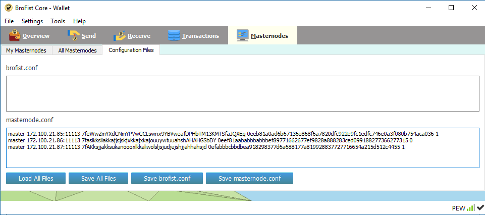

# Brofist Master Nodes Setup Guide

**Please, update your brofist wallet to the latest version:** https://github.com/modcrypto/brofist/releases


## Multi-Level Master Node 
|Tier	| PEW Require	| MN Reward |
|-----|--------------|-----------|
| 1	| 1,250 PEW	  	|   6.67%   |
| 2	| 2,500 PEW	   |	13.33%   |
| 3	| 5,000 PEW	   |	26.67%   |
| 4	| 10,000 PEW	|	53.33%   |
| 5	| 20,000 PEW	|	66.67%   |
| 6	| 50,000 PEW	|	80.00%   |

Send PEW meet the tier required to your MN wallet. It needs 20-30 minutes for transaction confirmation (At least 15 confirms).
You can buy PEW at : https://ubit.pw/markets/brofistbtc  
 
## Two Options for Setting up your Wallet
1. [One GUI wallet control multiple masternodes on VPS.](#option1)
   I recommended this option if you are consolidating wallets
   
2. [Install masternode on GUI Wallet](#option2)
   You need to open the wallet 24/7, and static IPV4.


LINUX Setup Guide
============
* VPS >= 1 GB of RAM, OS : Linux Ubuntu 16.04
* Brofist Wallet https://github.com/modcrypto/brofist/releases 

### 1. Steps to Create a New Sudo User
You can skip this step, if you already have user account.
1. Log in to your VPS server as the root user.
2. Use the adduser command to add a new user to your system.
3. Use the usermod command to add the user to the sudo group.
4. Close the terminal and re-login with your new username.

(You can replace ***brofist*** with the username that you want to create.)
```bash 
adduser brofist
usermod -aG sudo brofist
```

### 2. Prepare the environment for runnning the Brofist wallet
Login with your brofist username.
Please run theses command line by line.
```bash
sudo apt-get update 
sudo apt-get upgrade 
sudo apt-get install git automake build-essential libtool autotools-dev autoconf pkg-config nano software-properties-common
sudo apt-get install libssl-dev libboost-all-dev libevent-dev 
sudo apt-add-repository ppa:bitcoin/bitcoin 
sudo apt-get update 
sudo apt-get install libdb4.8-dev libdb4.8++-dev sudo libminiupnpc-dev libzmq3-dev
```

### 3. Download and Setup the Brofist Core Masternode.
Download the latest file "brofistmaster_ubuntu.x.x.tar.gz"
Example commands:

```bash
wget https://github.com/modcrypto/brofist/releases/download/1.0.2.12/brofist_ubuntu1604_1.0.2.12.tar.gz
tar -xvf brofist_ubuntu1604_1.0.2.12.tar.gz
sudo cp linux/b* /usr/bin 

```

Master Node Setup Guide
============
1. Install new wallet.

You must install one Brofist wallet on each VPS.  
**Each Brofist masternode needs an unique IP address.** 
There are 2 options:  1) brofist-qt (GUI) or 2) brofistd (Daemon No-GUI control via RPC)
 
1.1 For Windows (recommend to use brofist-qt)
- Download  https://github.com/modcrypto/brofist/releases/download/1.0.2.12/brofist-qt_win32_1.0.2.12.zip
- Unzip and Open your QT Wallet : brofist-qt.exe
- Wait Until blockchain and masternode synced.
- Go to Menu: Files/Receiving Address  and copy the resulting wallet address

1.2 For Linux  (recommend to use brofistd and brofist-cli ) 
- start the wallet daemon with command: 
```  
  brofistd -daemon
```
  and wait until the wallet synce. 
- You can view information of this wallet with the command:
```  
  brofist-cli getinfo 
```

1.3 Generate new Brofist wallet address with command:
```  
  brofist-cli getnewaddress master  
```
Copy the resulting wallet address  

2. Goto your main wallet and send the PEW coin to new wallet address in step 1.
Please see the above table for the requirement PEW for each masternode level. 
You needs to wait 20-30 minutes for transaction confirmation (At least 15 confirms).
You can buy PEW at : https://ubit.pw/markets/brofistbtc  

3. Back to your VPS wallet.
- Check for valid masternode output collateral.
```  
  brofist-cli masternode outputs  
```
If your wallet ready to be the masternode, it will return the transaction no output.
For example
```  
{
  "0eeb81a0ad6b67136e868f6a7820dfc922e9fc1edfc746e0a3f080b754aca036": "1"
}
```  
4. Generate Masternode Private Key
```  
  brofist-cli masternode genkey
```
You will get the result like this:
```  
7feWwZmYXdCNmYPVwCCLswnx9YBVweafDPHbTM13KMTSfaJQXEq
```
5. Create or Edit file brofist.conf
For windows, it should is in  C:\Users\<Your Name>\AppData\Roaming\BroFistCore

For LINUX, it should is in  $HOME/.brofistcore

Example : brofist.conf
```  
listen=1
daemon=1
server=1
rpcuser=pew
rpcpassword=password
rpcallowip=127.0.0.1
maxconnections=30
masternode=1
masternodeprivkey=7feWwZmYXdCNmYPVwCCLswnx9YBVweafDPHbTM13KMTSfaJQXEq
```
The masternodeprivkey is copied from the output of step 4.

6. Check your public IP address.

```  
curl ipinfo.io/ip

ifconfig 

```

You will see your **public ip** and  **inet addr**; Both ip must be the same address.
You cannot use the local ip such as 127.x.x.x, 192.168.x or 169.254.x.x  .

7. Create or Edit file masternode.conf

For windows, it should is in  C:\Users\<Your Name>\AppData\Roaming\BroFistCore
For LINUX, it should is in  $HOME/.brofistcore

`masternode.conf` format is a space seperated text file. Each line consisting of an alias, IP address followed by port, masternode private key, collateral output transaction id and collateral output index.

```
alias ipaddress:port masternode_private_key collateral_output collateral_output_index
```

- ipaddress -- from step 6
- port -- must be 11113
- masternode_private_key -- from step 4
- collateral_output and collateral_output_inde -- from step 3

Example:

```
master 172.100.21.85:11113 7feWwZmYXdCNmYPVwCCLswnx9YBVweafDPHbTM13KMTSfaJQXEq 0eeb81a0ad6b67136e868f6a7820dfc922e9fc1edfc746e0a3f080b754aca036 1
```

8. Restart the brofist daemon
```
 brofist-cli stop
# wait for 3 second 
 brofistd -daemon

# wait for 3 minutes
 brofist-cli masternode start-all
 brofist-cli masternode start

# check the masternode status
 brofist-cli masternode status
 brofist-cli masternode list-conf
 
```

## <a name="option1"></a>Setting GUI wallet for control multiple masternodes on VPS.

If you have many VPS, you can control all of them with a Brofist GUI wallet.

1. Dump the private key from your masterNode's pulic key.

- For daemon wallet(Linux), type the command:
```
brofist-cli dumpprivkey [the wallet address]
```
Copy the resulting priviate key. You'll use it in the next step.

- If you cannot remember the wallet address, type these commands:
```
brofist-cli getaccountaddress master

# or

brofist-cli masternode status

```

You must dump the private key from all masternode.


2. Open your QT Wallet and go to console (from the menu select `Tools` => `Debug Console`)

Import the private key from the step above.

```
importprivkey [masternode_private_key_from_step1] [masternode_name] [true/false]
```

For example, if you have 3 masternodes, you should use these command for importing the wallet address.
```
importprivkey WS2zZWyakjsec4ensakkslW9epQxJFBN3HjnnB4q2s412n7HBmGrs master1 false
importprivkey Zk2zZWyakjsec4ensakksaoaklajlali1alklKaksllskiKakKKSK master2 false
importprivkey ajkjsIIKKKnajshh18skKAllsksjdnjzjklslioiwkkkakspooakw master3 true
```
The wallet will re-scan and you will see your available balance increase by the amount that were in the imported wallets.

3. Config local Brofist masternode.conf
3.1 Setting your wallet option by enabling "Show Masternodes Tab". (restart wallet after save the setting)


3.1 Add the config from all remote masternode.conf to the local masternode.conf

For example, if you have three masternode.
VPS1: .brofistcore/masternode.conf
`master 172.100.21.85:11113 7feWwZmYXdCNmYPVwCCLswnx9YBVweafDPHbTM13KMTSfaJQXEq 0eeb81a0ad6b67136e868f6a7820dfc922e9fc1edfc746e0a3f080b754aca036 1`

VPS2: .brofistcore/masternode.conf
`master 172.100.21.86:11113 7faslkksllakkajjsjskjxkkajxkajouuywtuuahshAHAHGSbDY 0eef81aababbbabbbef89771662677ef9828a888283ced099188277366277315 0`

VPS3: .brofistcore/masternode.conf
`master 172.100.21.87:11113 7fAKksjjakksukanoooxlkkaliwolsljsjudjejshjjahhahsjd 0efabbbcbbdbea918298377d6a688177a819928837727716654a215d512c4455 1`

Then, your local masternode.conf should be
```
master1 172.100.21.85:11113 7feWwZmYXdCNmYPVwCCLswnx9YBVweafDPHbTM13KMTSfaJQXEq 0eeb81a0ad6b67136e868f6a7820dfc922e9fc1edfc746e0a3f080b754aca036 1
master2 172.100.21.86:11113 7faslkksllakkajjsjskjxkkajxkajouuywtuuahshAHAHGSbDY 0eef81aababbbabbbef89771662677ef9828a888283ced099188277366277315 0
master3 172.100.21.87:11113 7fAKksjjakksukanoooxlkkaliwolsljsjudjejshjjahhahsjd 0efabbbcbbdbea918298377d6a688177a819928837727716654a215d512c4455 1
```



Save masternode.conf and restart the wallet.
